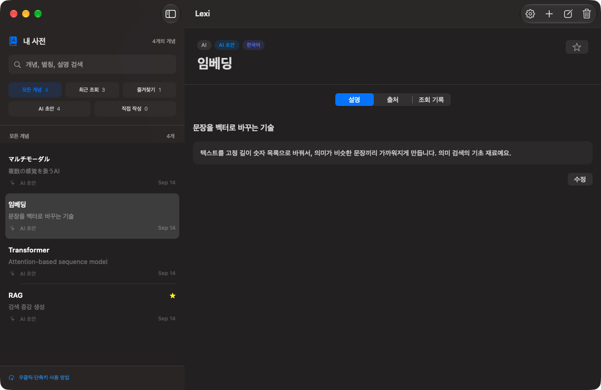
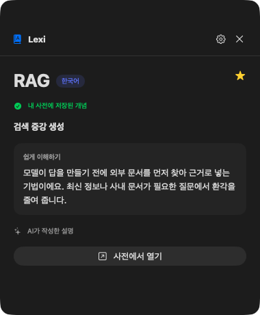
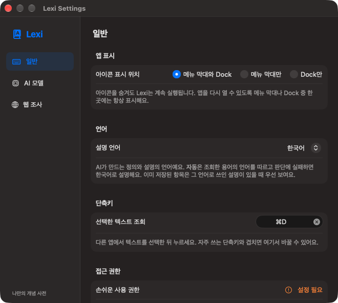

# Lexi

[한국어](README.md) | [English](README.en.md) | **日本語** | [中文](README.zh.md)

<p align="center">
  
</p>

<p align="center">
  <strong>選択した未知の表現をその場で調べ、自分の辞書として積み重ねられる、macOS向けローカルファーストAI辞書</strong>
</p>

<p align="center">
  <a href="https://github.com/project-oxi/lexi/releases/latest">最新リリース</a> ·
  <a href="https://github.com/project-oxi/lexi/actions/workflows/ci.yml"></a> ·
  <a href="https://github.com/project-oxi/lexi/releases"></a>
</p>

Lexiは、すでに保存済みの表現はAIを呼び出さずに即座に表示し、初めて見る表現についてのみローカルのMLXモデルで説明を生成します。ウェブ調査はユーザーが有効にした場合にのみ実行され、実際に読んだ公開資料だけを出典として保存します。

## 主な機能

- `⌘D` のグローバルショートカットで、現在選択しているテキストを即座に検索
- macOSのサービスメニューによる **Lexiに聞く（Lexi에게 물어보기）** 対応
- メニューバーからクリップボード検索、辞書を開く、設定へのアクセス
- カーソルの近くに現れる軽量なクイック表示パネル
- 見出し語・別名・お気に入り・出典・編集履歴を保存する個人辞書
- 多言語埋め込みにより、意味の近い項目同士で保存済みの概念を探せる意味検索
- 韓国語・英語・日本語・中国語など8言語を自動で判別して記録する多言語検索。説明の言語を選ぶと、その言語で書かれた保存済みの説明を優先的に表示します
- Apple Silicon上で動作するMLXベースのローカル言語モデル
- ユーザーが明示的に許可した場合にのみ実行されるDuckDuckGoベースのウェブ調査
- AIの下書きとユーザーの編集版を区別して保存する改訂履歴

## スクリーンショット

| ライブラリ全体 | インスタント検索パネル |
| --- | --- |
|  |  |



## インストール

1. [Releases](https://github.com/project-oxi/lexi/releases/latest)から最新の `Lexi-*-macOS-arm64.zip` をダウンロードします。
2. アーカイブを展開し、`Lexi.app` をアプリケーションフォルダに移動します。
3. Lexiを起動します。配布ファイルはDeveloper IDで署名され、Apple公証を経ています。
4. 選択テキスト検索を初めて使う際に、macOSが求める **アクセシビリティ（손쉬운 사용）** 権限を許可します。

> LexiはApple Silicon MacとmacOS 14 Sonoma以降をサポートします。初回のAI生成時に選択したMLXモデルをHugging Faceからダウンロードするため、ネットワーク接続と数GBの空き容量が必要になる場合があります。

## 使い方

### 選択テキストの検索

他のアプリでテキストを選択して `⌘D` を押します。LexiはアクセシビリティAPIで選択範囲を読み取ります。読み取りに失敗した場合でも、クリップボードの内容に代用せず、辞書ウィンドウを開きます。

アプリの右クリックメニューから **サービス → Lexiに聞く** を選ぶこともできます。この経路では、アクセシビリティ権限なしで選択したテキストを受け取れます。

メニューが表示されない場合は、Lexiの **設定 → 一般 → 右クリックサービス** で **リストを再読み込み（목록 새로고침）** を押してから、使っていたアプリのメニューを開き直してみてください。macOSの **システム設定 → キーボード → キーボードショートカット → サービス** で **Lexiに聞く** が有効になっているかも確認してください。サービスを提供するアプリは、他のアプリの右クリックメニューの最上位に項目を固定することはできず、メニューの構成は呼び出し側のアプリが決めます。最も速い呼び出し経路はLexi設定のグローバルショートカットであり、アクセシビリティ権限なしでショートカットから呼び出したい場合は、macOSのサービス設定でこの項目に個別のショートカットを割り当てることもできます。

### 辞書と編集履歴

左パネルの検索フィールドとカテゴリボタンで、すべての概念・最近の検索・お気に入り・AI下書き・手動作成の各リストを切り替えながら閲覧し、右側で説明を読みます。検索は概念・別名・一行定義をまとめて対象にします。 **意味で検索（의미로 찾기）** を押すと、通常の検索結果と重複しない保存済みの概念を、多言語埋め込みの類似度順にまとめて表示します。 **概念を追加（개념 추가）** または `⌘N` で手動で作成することも、概念名だけを入力してAIで検索することもできます。リストの右クリックメニューでは、お気に入りへの追加や名前のコピーもサポートしています。

保存済みの見出し語や別名が完全に一致していれば、結果を即座に表示します。存在しない表現は、ローカルモデルが下書きを作成して辞書に保存します。AIが生成した内容は下書きなので、重要な定義は自分で確認して修正してください。

### 設定

- **MLXモデル**: Qwen3 4B（デフォルト）・1.7B（軽量モデル）・8B（大モデル）から選択すると、すぐに保存されます。 **カスタム（사용자 지정）** を選ぶと、Hugging FaceのMLXモデルIDを直接入力して適用できます。
- **ウェブ調査（웹 조사）**: デフォルトはオフです。オンにすると、検索語と公開ウェブページへのリクエストが外部に送信されます。
- **ショートカットと権限**: 一般タブで検索ショートカットを変更し、アクセシビリティ権限を確認できます。
- **説明の言語（설명 언어）**: 一般タブで、AIが生成する定義・説明の言語を選びます。 **自動（자동）** は検索した用語の言語に従い、判定に失敗した場合は韓国語で説明します。項目ごとに用語・別名・説明の言語を記録するため、同じ概念に言語の異なる説明があっても、要求した言語の説明を優先的に表示します。
- **即時反映**: モデルIDは **適用（적용）** を押すと保存され、ウェブ調査の変更とともに次の検索から反映されます。アプリを再起動する必要はありません。

## プライバシーとネットワーク

- 辞書データは `~/Library/Application Support/Lexi/lexi.sqlite` にローカルに保存されます。
- 保存済みの表現を検索する際には、ネットワークもAIも使用しません。
- 生成モデルと、意味検索用の `multilingual-e5-small` モデルの重みは、それぞれの機能を初めて使うときにHugging Faceからダウンロードされます。
- 意味検索は明示的に **意味で検索** を押したときにのみ実行され、検索語と辞書内容の埋め込み計算はMacの内部で行われます。埋め込みは派生的なメモリキャッシュであり、辞書の原文や改訂履歴を変更することはありません。
- ウェブ調査をオンにした場合にのみ、DuckDuckGo検索と検索結果ページへのリクエストが発生します。
- テレメトリや独自のアナリティクスサーバーは含まれていません。

## ソースからビルド

要件:

- Apple Silicon Mac
- macOS 14以降
- Xcode 16以降
- [XcodeGen](https://github.com/yonaskolb/XcodeGen)

```bash
git clone https://github.com/project-oxi/lexi.git
cd lexi
brew install xcodegen
xcodegen generate
open Lexi.xcodeproj
```

Xcodeで `Lexi` スキームを選択して実行します。このリポジトリは生成された `.xcodeproj` をコミットせず、`project.yml` をプロジェクト設定の基準として使用します。

コアパッケージのテストは次のように実行します。

```bash
swift test --package-path Packages/LexiCore
```

署名なしReleaseビルドの確認:

```bash
xcodegen generate
xcodebuild \
  -project Lexi.xcodeproj \
  -scheme Lexi \
  -configuration Release \
  CODE_SIGNING_ALLOWED=NO \
  build
```

## 構成

```text
App/                         SwiftUI・AppKitアプリとクイック表示UI
Packages/LexiCore/           SQLite、検索、MLX、ウェブ調査のコアロジック
docs/PDC-MIGRATION.md        Portable Document Contractのインポート・エクスポート計画
AGENTS.md                    リポジトリ作業の優先順位とPDC適用ルール
project.yml                  XcodeGenプロジェクト定義
.github/workflows/ci.yml     テストと署名なしビルドの検証
.github/workflows/release.yml Developer ID署名・公証・GitHub Release
```

## 主な依存関係

| パッケージ | 用途 | ライセンス |
| --- | --- | --- |
| [GRDB.swift](https://github.com/groue/GRDB.swift) | SQLiteストレージ | MIT |
| [mlx-swift-examples](https://github.com/ml-explore/mlx-swift-examples) | ローカルMLX LLM・多言語埋め込み | MIT |
| [mlx-swift](https://github.com/ml-explore/mlx-swift) | 埋め込みテンソル演算 | MIT |
| [KeyboardShortcuts](https://github.com/sindresorhus/KeyboardShortcuts) | グローバルショートカット | MIT |

推移的依存関係には `swift-transformers`、`swift-collections`、`swift-numerics`、`swift-jinja`、`GzipSwift` が含まれます。各著作権とライセンスはそれぞれのプロジェクトに従います。

## リリースのセキュリティ

`v*` タグは、GitHub Actionsで次の手順を実行します。

1. 一時キーチェーンへのDeveloper ID証明書のインポート
2. Releaseアーカイブの作成とコード署名の検証
3. Apple notary serviceへの提出と承認待ち
4. 公証チケットのステープルとGatekeeper検証
5. SHA-256チェックサムとともにGitHub Releaseを公開

証明書とパスワードはGitHub Actions secretsにのみ保存し、リポジトリにはコミットしません。

## ライセンス

現在、このリポジトリには個別のオープンソースライセンスは付与されていません。別途明示のない限り、コードの複製・改変・再配布の権利が許諾されることはありません。

アプリのサービス宣言・呼び出しおよび設定の回帰テスト:

```bash
xcodegen generate
xcodebuild -project Lexi.xcodeproj -scheme Lexi -configuration Debug \
  -destination 'platform=macOS,arch=arm64' CODE_SIGNING_ALLOWED=NO test
```
